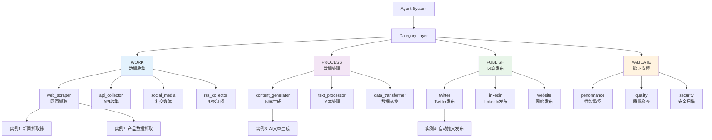

# Agent类型架构明确化和UI改进设计文档

## 概述

本设计文档详细说明了Agent Type和Category的关系架构，以及如何实现选择式创建流程和No-Code配置面板，提升用户体验和降低使用门槛。

## 架构设计

### Agent类型层级架构



### 数据模型设计

#### Agent Type Registry（Agent类型注册表）

```typescript
interface AgentTypeDefinition {
  // 唯一标识符（格式：category.type_name）
  id: string; // 例如：'work.web_scraper'
  
  // 基本信息
  name: string; // 显示名称，例如：'Web Scraper'
  displayName: {
    zh: string; // '网页抓取器'
    en: string; // 'Web Scraper'
  };
  description: string;
  icon: string; // 图标名称或URL
  
  // 分类信息
  category: AgentCategory;
  categoryPath: string; // 例如：'WORK > Web Scraper'
  
  // 元数据
  version: string;
  author: string;
  tags: string[];
  complexity: 'easy' | 'medium' | 'hard';
  popularity: number; // 使用次数
  rating: number; // 用户评分
  
  // 功能特性
  features: string[];
  capabilities: string[];
  limitations: string[];
  
  // 配置定义
  configSchema: AgentConfigSchema;
  defaultConfig: Partial<AgentConfig>;
  configPresets: ConfigPreset[];
  
  // 依赖和要求
  requirements: {
    minMemory: number;
    minCpu: number;
    dependencies: string[];
    permissions: string[];
  };
  
  // 文档和示例
  documentation: {
    overview: string;
    quickStart: string;
    apiReference: string;
    examples: CodeExample[];
  };
  
  // 状态
  status: 'stable' | 'beta' | 'experimental' | 'deprecated';
  isAvailable: boolean;
  releaseDate: Date;
  lastUpdated: Date;
}

interface ConfigPreset {
  id: string;
  name: string;
  description: string;
  scenario: string; // 适用场景
  config: Partial<AgentConfig>;
  tags: string[];
  isOfficial: boolean;
  author?: string;
  usageCount: number;
}

interface AgentConfigSchema {
  type: 'object';
  properties: {
    [key: string]: ConfigFieldSchema;
  };
  required: string[];
  dependencies?: {
    [key: string]: string[];
  };
}

interface ConfigFieldSchema {
  type: 'string' | 'number' | 'boolean' | 'array' | 'object';
  title: string;
  description: string;
  default?: any;
  enum?: any[];
  minimum?: number;
  maximum?: number;
  pattern?: string;
  format?: string;
  items?: ConfigFieldSchema;
  properties?: {
    [key: string]: ConfigFieldSchema;
  };
  // UI相关
  ui: {
    widget: 'input' | 'textarea' | 'select' | 'checkbox' | 'slider' | 'file' | 'code';
    placeholder?: string;
    helpText?: string;
    group?: string; // 配置分组
    order?: number; // 显示顺序
    conditional?: {
      field: string;
      value: any;
    };
  };
}
```

## 组件设计

### 1. Agent Type Selector（Agent类型选择器）

```typescript
interface AgentTypeSelectorProps {
  onSelect: (typeId: string) => void;
  selectedCategory?: AgentCategory;
  showCategoryFirst?: boolean;
}

// 组件结构
<AgentTypeSelector>
  <CategoryStep>
    <CategoryCard category="WORK" />
    <CategoryCard category="PROCESS" />
    <CategoryCard category="PUBLISH" />
    <CategoryCard category="VALIDATE" />
  </CategoryStep>
  
  <TypeStep category={selectedCategory}>
    <TypeGrid>
      <TypeCard type="web_scraper" />
      <TypeCard type="api_collector" />
      <TypeCard type="social_media" />
    </TypeGrid>
  </TypeStep>
  
  <ConfirmationStep>
    <TypeSummary />
    <ActionButtons />
  </ConfirmationStep>
</AgentTypeSelector>
```

### 2. No-Code Config Panel（无代码配置面板）

```typescript
interface NoCodeConfigPanelProps {
  agentType: string;
  initialConfig?: Partial<AgentConfig>;
  onConfigChange: (config: AgentConfig) => void;
  onValidate: (isValid: boolean, errors: ValidationError[]) => void;
}

// 组件结构
<NoCodeConfigPanel>
  <ConfigHeader>
    <TypeInfo />
    <ModeToggle /> {/* No-Code / Code */}
  </ConfigHeader>
  
  <ConfigForm>
    <ConfigSection title="基本设置">
      <FormField name="name" type="input" />
      <FormField name="description" type="textarea" />
    </ConfigSection>
    
    <ConfigSection title="数据源配置">
      <FormField name="url" type="input" />
      <FormField name="selectors" type="code" />
    </ConfigSection>
    
    <ConfigSection title="高级选项" collapsible>
      <FormField name="timeout" type="slider" />
      <FormField name="retries" type="number" />
    </ConfigSection>
  </ConfigForm>
  
  <ConfigActions>
    <PreviewButton />
    <TestButton />
    <SaveButton />
  </ConfigActions>
</NoCodeConfigPanel>
```

### 3. Agent Type Library（Agent类型库）

```typescript
interface AgentTypeLibraryProps {
  onSelectType: (typeId: string) => void;
  filterCategory?: AgentCategory;
  searchQuery?: string;
}

// 组件结构
<AgentTypeLibrary>
  <LibraryHeader>
    <SearchBar />
    <FilterBar>
      <CategoryFilter />
      <ComplexityFilter />
      <StatusFilter />
    </FilterBar>
    <ViewToggle /> {/* Grid / List */}
  </LibraryHeader>
  
  <LibraryContent>
    <CategorySection category="WORK">
      <TypeCard type="web_scraper">
        <TypeIcon />
        <TypeInfo />
        <TypeStats />
        <QuickActions />
      </TypeCard>
      {/* More type cards */}
    </CategorySection>
    
    {/* More category sections */}
  </LibraryContent>
  
  <TypeDetailModal>
    <DetailHeader />
    <DetailTabs>
      <OverviewTab />
      <ConfigTab />
      <ExamplesTab />
      <DocumentationTab />
    </DetailTabs>
    <DetailActions />
  </TypeDetailModal>
</AgentTypeLibrary>
```

### 4. Config Wizard（配置向导）

```typescript
interface ConfigWizardProps {
  agentType: string;
  onComplete: (config: AgentConfig) => void;
  onCancel: () => void;
}

// 向导步骤
const wizardSteps = [
  {
    id: 'basic',
    title: '基本信息',
    description: '设置Agent的名称和描述',
    fields: ['name', 'description']
  },
  {
    id: 'datasource',
    title: '数据源配置',
    description: '配置数据来源和采集规则',
    fields: ['url', 'selectors', 'pagination']
  },
  {
    id: 'processing',
    title: '数据处理',
    description: '设置数据清洗和转换规则',
    fields: ['filters', 'transformers', 'validators']
  },
  {
    id: 'schedule',
    title: '执行计划',
    description: '配置Agent的运行时间和频率',
    fields: ['schedule', 'timezone', 'retries']
  },
  {
    id: 'review',
    title: '确认配置',
    description: '检查并确认所有配置',
    fields: []
  }
];

// 组件结构
<ConfigWizard>
  <WizardProgress steps={wizardSteps} currentStep={currentStep} />
  
  <WizardContent>
    <StepHeader />
    <StepForm>
      {/* 动态渲染当前步骤的表单字段 */}
    </StepForm>
    <StepHelp />
  </WizardContent>
  
  <WizardActions>
    <BackButton />
    <NextButton />
    <SkipButton />
  </WizardActions>
</ConfigWizard>
```

## UI/UX设计

### 创建流程设计

```
Step 1: 选择Category
┌─────────────────────────────────────────┐
│  选择Agent类别                            │
│                                         │
│  ┌──────┐  ┌──────┐  ┌──────┐  ┌──────┐│
│  │ WORK │  │PROCESS│ │PUBLISH│ │VALIDATE││
│  │ 📥   │  │  ⚙️   │  │  📤  │  │  ✓   ││
│  │数据  │  │数据  │  │内容  │  │验证  ││
│  │收集  │  │处理  │  │发布  │  │监控  ││
│  └──────┘  └──────┘  └──────┘  └──────┘│
└─────────────────────────────────────────┘

Step 2: 选择Type
┌─────────────────────────────────────────┐
│  WORK > 选择具体类型                      │
│                                         │
│  ┌────────────┐  ┌────────────┐        │
│  │ 🌐 Web     │  │ 🔌 API     │        │
│  │ Scraper    │  │ Collector  │        │
│  │            │  │            │        │
│  │ 网页抓取器  │  │ API收集器  │        │
│  │ ⭐⭐⭐      │  │ ⭐⭐       │        │
│  │ 中等难度    │  │ 简单       │        │
│  └────────────┘  └────────────┘        │
│                                         │
│  ┌────────────┐  ┌────────────┐        │
│  │ 📱 Social  │  │ 📰 RSS     │        │
│  │ Media      │  │ Collector  │        │
│  └────────────┘  └────────────┘        │
└─────────────────────────────────────────┘

Step 3: 配置Agent
┌─────────────────────────────────────────┐
│  配置 Web Scraper                        │
│  ┌─────────────────────────────────────┐│
│  │ 模式: ● No-Code  ○ Code            ││
│  └─────────────────────────────────────┘│
│                                         │
│  基本设置                                │
│  ┌─────────────────────────────────────┐│
│  │ 名称: [我的网页抓取器____________]   ││
│  │ 描述: [抓取新闻网站的文章内容____]   ││
│  └─────────────────────────────────────┘│
│                                         │
│  数据源配置                              │
│  ┌─────────────────────────────────────┐│
│  │ URL: [https://example.com_______]   ││
│  │ 选择器:                             ││
│  │  标题: [.article-title__________]   ││
│  │  内容: [.article-content________]   ││
│  └─────────────────────────────────────┘│
│                                         │
│  [预览配置] [测试运行] [保存并创建]      │
└─────────────────────────────────────────┘
```

### Category卡片设计

```typescript
<CategoryCard>
  <Icon size="large" /> {/* 大图标 */}
  <Title>WORK</Title>
  <Subtitle>数据收集</Subtitle>
  <Description>
    从各种数据源收集和采集数据
  </Description>
  <TypeCount>4种类型可用</TypeCount>
  <Examples>
    <Tag>网页抓取</Tag>
    <Tag>API收集</Tag>
    <Tag>社交媒体</Tag>
  </Examples>
</CategoryCard>
```

### Type卡片设计

```typescript
<TypeCard>
  <Header>
    <Icon />
    <Badge complexity="medium">中等</Badge>
    <Badge status="stable">稳定</Badge>
  </Header>
  
  <Body>
    <Title>Web Scraper</Title>
    <Subtitle>网页抓取器</Subtitle>
    <Description>
      使用CSS选择器从网页提取数据
    </Description>
    
    <Features>
      <Feature>✓ CSS选择器</Feature>
      <Feature>✓ 速率限制</Feature>
      <Feature>✓ 数据清洗</Feature>
    </Features>
    
    <Stats>
      <Stat icon="⭐">4.8</Stat>
      <Stat icon="📥">1.2k</Stat>
      <Stat icon="👤">Platform Team</Stat>
    </Stats>
  </Body>
  
  <Actions>
    <Button variant="primary">使用此类型</Button>
    <Button variant="ghost">查看详情</Button>
  </Actions>
</TypeCard>
```

## 实施计划

### 阶段1：数据模型和API

1. 定义AgentTypeDefinition接口
2. 创建AgentTypeRegistry服务
3. 实现Type注册和查询API
4. 添加ConfigSchema验证

### 阶段2：UI组件开发

1. 开发CategorySelector组件
2. 开发TypeSelector组件
3. 开发NoCodeConfigPanel组件
4. 开发ConfigWizard组件

### 阶段3：集成和优化

1. 集成到现有Agent创建流程
2. 添加配置预设功能
3. 实现测试运行功能
4. 优化用户体验

## 技术实现

### Agent Type Registry Service

```typescript
class AgentTypeRegistry {
  private types: Map<string, AgentTypeDefinition> = new Map();
  
  // 注册Agent类型
  registerType(definition: AgentTypeDefinition): void {
    this.types.set(definition.id, definition);
  }
  
  // 获取所有类型
  getAllTypes(): AgentTypeDefinition[] {
    return Array.from(this.types.values());
  }
  
  // 按Category获取类型
  getTypesByCategory(category: AgentCategory): AgentTypeDefinition[] {
    return this.getAllTypes().filter(t => t.category === category);
  }
  
  // 获取单个类型
  getType(typeId: string): AgentTypeDefinition | undefined {
    return this.types.get(typeId);
  }
  
  // 搜索类型
  searchTypes(query: string): AgentTypeDefinition[] {
    const lowerQuery = query.toLowerCase();
    return this.getAllTypes().filter(t => 
      t.name.toLowerCase().includes(lowerQuery) ||
      t.description.toLowerCase().includes(lowerQuery) ||
      t.tags.some(tag => tag.toLowerCase().includes(lowerQuery))
    );
  }
  
  // 验证配置
  validateConfig(typeId: string, config: any): ValidationResult {
    const type = this.getType(typeId);
    if (!type) {
      return { isValid: false, errors: ['Unknown agent type'] };
    }
    
    // 使用JSON Schema验证
    return validateAgainstSchema(config, type.configSchema);
  }
}
```

### Dynamic Form Generator

```typescript
class DynamicFormGenerator {
  generateForm(schema: AgentConfigSchema): FormField[] {
    const fields: FormField[] = [];
    
    for (const [key, fieldSchema] of Object.entries(schema.properties)) {
      fields.push({
        name: key,
        label: fieldSchema.title,
        type: this.mapSchemaTypeToWidget(fieldSchema),
        required: schema.required?.includes(key),
        defaultValue: fieldSchema.default,
        validation: this.generateValidation(fieldSchema),
        ui: fieldSchema.ui
      });
    }
    
    // 按order排序
    return fields.sort((a, b) => 
      (a.ui?.order || 999) - (b.ui?.order || 999)
    );
  }
  
  private mapSchemaTypeToWidget(schema: ConfigFieldSchema): string {
    if (schema.ui?.widget) {
      return schema.ui.widget;
    }
    
    // 自动推断widget类型
    if (schema.enum) return 'select';
    if (schema.type === 'boolean') return 'checkbox';
    if (schema.type === 'number') return 'number';
    if (schema.format === 'textarea') return 'textarea';
    
    return 'input';
  }
}
```

## 成功标准

1. **用户理解度**: 90%的新用户能正确理解Category和Type的关系
2. **创建成功率**: Agent创建成功率提升到95%以上
3. **配置错误率**: 配置错误率降低70%
4. **创建时间**: 平均创建时间减少50%
5. **用户满意度**: No-Code配置面板满意度达到4.5/5以上
