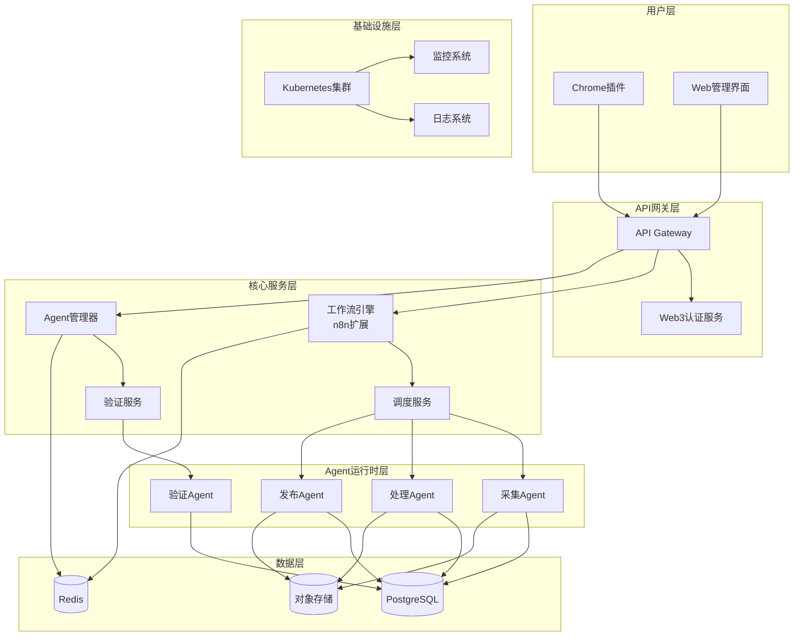

# 设计文档

## 概述

多Agent自动化平台是一个基于Web3身份认证的去中心化Agent编排系统，采用微服务架构和容器化部署。平台核心基于n8n工作流引擎扩展，集成CrewAI多Agent框架，通过Chrome插件提供用户交互界面，实现从数据采集到内容发布的完整自动化流程。

## 架构

### 系统架构图



### 技术栈选择

**前端技术栈：**
- Chrome插件：Manifest V3 + React + TypeScript
- Web界面：React + TypeScript + Tailwind CSS
- Web3集成：ethers.js + WalletConnect

**后端技术栈：**
- 工作流引擎：n8n (Node.js) + 自定义Agent节点
- Agent框架：CrewAI + FastAPI (Python)
- API网关：Kong + JWT认证
- 数据库：PostgreSQL + Redis
- 消息队列：Redis Streams

**基础设施：**
- 容器化：Docker + Kubernetes
- 云平台：Cloudflare Workers + Railway/Render
- 监控：Prometheus + Grafana
- 日志：ELK Stack

## 组件和接口

### 1. 统一Agent接口设计

**核心理念：** 所有Agent都基于统一的接口模板，确保一致性和快速开发

**基础Agent接口：**
```typescript
// 统一Agent基础接口
interface IAgent {
  // Agent元信息
  readonly id: string
  readonly name: string
  readonly version: string
  readonly category: AgentCategory
  readonly description: string
  
  // 生命周期方法
  initialize(config: AgentConfig): Promise<void>
  execute(input: AgentInput): Promise<AgentOutput>
  cleanup(): Promise<void>
  
  // 状态管理
  getStatus(): AgentStatus
  getMetrics(): AgentMetrics
  
  // 配置管理
  validateConfig(config: AgentConfig): ValidationResult
  updateConfig(config: Partial<AgentConfig>): Promise<void>
}

// Agent分类枚举
enum AgentCategory {
  WORK = 'work',           // 工作Agent - 数据采集
  PROCESS = 'process',     // 处理Agent - 数据处理和转换
  PUBLISH = 'publish',     // 发布Agent - 内容发布和分发
  VALIDATE = 'validate'    // 验证Agent - 有效工作验证
}

// 统一输入输出接口
interface AgentInput {
  data: any
  metadata: InputMetadata
  context: ExecutionContext
}

interface AgentOutput {
  data: any
  metadata: OutputMetadata
  metrics: ExecutionMetrics
  status: ExecutionStatus
}

// Agent模板基类
abstract class BaseAgent implements IAgent {
  protected config: AgentConfig
  protected logger: Logger
  protected metrics: MetricsCollector
  
  constructor(
    public readonly id: string,
    public readonly name: string,
    public readonly version: string,
    public readonly category: AgentCategory,
    public readonly description: string
  ) {}
  
  // 模板方法模式 - 定义执行流程
  async execute(input: AgentInput): Promise<AgentOutput> {
    const startTime = Date.now()
    
    try {
      // 前置处理
      await this.preProcess(input)
      
      // 核心业务逻辑 - 子类实现
      const result = await this.doExecute(input)
      
      // 后置处理
      const output = await this.postProcess(result, input)
      
      // 记录成功指标
      this.recordSuccess(Date.now() - startTime)
      
      return output
    } catch (error) {
      // 记录失败指标
      this.recordFailure(error, Date.now() - startTime)
      throw error
    }
  }
  
  // 子类必须实现的核心逻辑
  protected abstract doExecute(input: AgentInput): Promise<any>
  
  // 可选的钩子方法
  protected async preProcess(input: AgentInput): Promise<void> {}
  protected async postProcess(result: any, input: AgentInput): Promise<AgentOutput> {
    return {
      data: result,
      metadata: this.createOutputMetadata(input),
      metrics: this.getExecutionMetrics(),
      status: ExecutionStatus.SUCCESS
    }
  }
}
```

### 2. 四类Agent具体接口

**Work Agent (工作Agent) - 数据采集：**
```typescript
interface IWorkAgent extends IAgent {
  // 采集特定方法
  setTarget(target: DataSource): Promise<void>
  startCollection(): Promise<void>
  stopCollection(): Promise<void>
  getCollectedData(filter?: DataFilter): Promise<CollectedData[]>
}

abstract class WorkAgent extends BaseAgent implements IWorkAgent {
  protected dataSource: DataSource
  protected collectionRules: CollectionRule[]
  
  constructor(id: string, name: string, version: string, description: string) {
    super(id, name, version, AgentCategory.WORK, description)
  }
  
  protected async doExecute(input: AgentInput): Promise<CollectedData[]> {
    // 统一的采集流程
    const targets = this.parseTargets(input)
    const results: CollectedData[] = []
    
    for (const target of targets) {
      const data = await this.collectFromTarget(target)
      const cleanedData = await this.cleanData(data)
      results.push(cleanedData)
    }
    
    return results
  }
  
  // 子类实现具体采集逻辑
  protected abstract collectFromTarget(target: DataTarget): Promise<RawData>
  protected abstract cleanData(data: RawData): Promise<CollectedData>
}
```

**Process Agent (处理Agent) - 数据处理：**
```typescript
interface IProcessAgent extends IAgent {
  // 处理特定方法
  setProcessingRules(rules: ProcessingRule[]): Promise<void>
  processData(data: any): Promise<ProcessedData>
  getProcessingHistory(): Promise<ProcessingRecord[]>
}

abstract class ProcessAgent extends BaseAgent implements IProcessAgent {
  protected processingRules: ProcessingRule[]
  protected llmService?: LLMService
  
  constructor(id: string, name: string, version: string, description: string) {
    super(id, name, version, AgentCategory.PROCESS, description)
  }
  
  protected async doExecute(input: AgentInput): Promise<ProcessedData> {
    // 统一的处理流程
    const rawData = this.extractData(input)
    const validatedData = await this.validateInput(rawData)
    const processedData = await this.processContent(validatedData)
    const qualityCheckedData = await this.checkQuality(processedData)
    
    return qualityCheckedData
  }
  
  // 子类实现具体处理逻辑
  protected abstract processContent(data: ValidatedData): Promise<ProcessedData>
  protected abstract checkQuality(data: ProcessedData): Promise<ProcessedData>
}
```

**Publish Agent (发布Agent) - 内容发布：**
```typescript
interface IPublishAgent extends IAgent {
  // 发布特定方法
  setPublishTarget(target: PublishTarget): Promise<void>
  schedulePublish(content: Content, schedule: Schedule): Promise<void>
  publishNow(content: Content): Promise<PublishResult>
  getPublishHistory(): Promise<PublishRecord[]>
}

abstract class PublishAgent extends BaseAgent implements IPublishAgent {
  protected publishTarget: PublishTarget
  protected publishQueue: PublishQueue
  
  constructor(id: string, name: string, version: string, description: string) {
    super(id, name, version, AgentCategory.PUBLISH, description)
  }
  
  protected async doExecute(input: AgentInput): Promise<PublishResult> {
    // 统一的发布流程
    const content = this.extractContent(input)
    const formattedContent = await this.formatForTarget(content)
    const validatedContent = await this.validateContent(formattedContent)
    const publishResult = await this.publishContent(validatedContent)
    
    return publishResult
  }
  
  // 子类实现具体发布逻辑
  protected abstract formatForTarget(content: Content): Promise<FormattedContent>
  protected abstract publishContent(content: FormattedContent): Promise<PublishResult>
}
```

**Validate Agent (验证Agent) - 有效工作验证：**
```typescript
interface IValidateAgent extends IAgent {
  // 验证特定方法
  setValidationTarget(target: Agent): Promise<void>
  performValidation(): Promise<ValidationResult>
  generateReport(): Promise<ValidationReport>
  getValidationHistory(): Promise<ValidationRecord[]>
}

abstract class ValidateAgent extends BaseAgent implements IValidateAgent {
  protected validationTarget: Agent
  protected validationRules: ValidationRule[]
  
  constructor(id: string, name: string, version: string, description: string) {
    super(id, name, version, AgentCategory.VALIDATE, description)
  }
  
  protected async doExecute(input: AgentInput): Promise<ValidationResult> {
    // 统一的验证流程
    const targetAgent = this.getTargetAgent(input)
    const metrics = await this.collectMetrics(targetAgent)
    const analysis = await this.analyzePerformance(metrics)
    const recommendations = await this.generateRecommendations(analysis)
    
    return {
      score: analysis.overallScore,
      metrics: metrics,
      analysis: analysis,
      recommendations: recommendations,
      timestamp: new Date()
    }
  }
  
  // 子类实现具体验证逻辑
  protected abstract collectMetrics(agent: Agent): Promise<AgentMetrics>
  protected abstract analyzePerformance(metrics: AgentMetrics): Promise<PerformanceAnalysis>
  protected abstract generateRecommendations(analysis: PerformanceAnalysis): Promise<Recommendation[]>
}
```

### 3. Web3认证服务

**职责：** 处理ETH钱包连接和用户身份验证

**接口设计：**
```typescript
interface AuthService {
  // 连接钱包
  connectWallet(walletType: WalletType): Promise<AuthResult>
  
  // 验证签名
  verifySignature(address: string, signature: string, message: string): Promise<boolean>
  
  // 获取用户配置
  getUserProfile(address: string): Promise<UserProfile>
  
  // 创建JWT令牌
  generateToken(address: string): Promise<string>
}

interface UserProfile {
  address: string
  createdAt: Date
  preferences: UserPreferences
  agentConfigs: AgentConfig[]
}
```

### 4. Agent模板系统

**职责：** 提供快速开发Agent的模板和脚手架

**模板生成器：**
```typescript
interface AgentTemplate {
  category: AgentCategory
  name: string
  description: string
  configSchema: JSONSchema
  codeTemplate: string
  dependencies: string[]
  examples: AgentExample[]
}

class AgentTemplateGenerator {
  // 生成Agent模板
  generateTemplate(category: AgentCategory, options: TemplateOptions): AgentTemplate {
    switch (category) {
      case AgentCategory.WORK:
        return this.generateWorkAgentTemplate(options)
      case AgentCategory.PROCESS:
        return this.generateProcessAgentTemplate(options)
      case AgentCategory.PUBLISH:
        return this.generatePublishAgentTemplate(options)
      case AgentCategory.VALIDATE:
        return this.generateValidateAgentTemplate(options)
    }
  }
  
  // 创建Agent实例
  createAgentFromTemplate(template: AgentTemplate, customCode: string): Agent {
    const AgentClass = this.compileAgentClass(template, customCode)
    return new AgentClass()
  }
}

// 配置模式定义
interface AgentConfigSchema {
  work: {
    dataSource: DataSourceConfig
    collectionRules: CollectionRuleConfig[]
    schedule: ScheduleConfig
    outputFormat: OutputFormatConfig
  }
  
  process: {
    inputFormat: InputFormatConfig
    processingRules: ProcessingRuleConfig[]
    llmConfig?: LLMConfig
    qualityThreshold: QualityThresholdConfig
  }
  
  publish: {
    targetPlatform: PlatformConfig
    contentFormat: ContentFormatConfig
    publishSchedule: ScheduleConfig
    retryPolicy: RetryPolicyConfig
  }
  
  validate: {
    validationRules: ValidationRuleConfig[]
    metricsToCollect: MetricConfig[]
    reportingSchedule: ScheduleConfig
    alertThresholds: AlertThresholdConfig
  }
}
```

### 5. 工作流引擎扩展

**职责：** 基于n8n扩展统一的Agent节点类型和执行逻辑

**核心扩展：**
```typescript
// 统一Agent节点基类
abstract class AgentNode extends INodeType {
  abstract agentCategory: AgentCategory
  
  // 统一执行接口
  async execute(context: IExecuteContext): Promise<INodeExecutionData[][]> {
    const agent = this.createAgentInstance()
    const input = this.convertContextToAgentInput(context)
    const output = await agent.execute(input)
    return this.convertAgentOutputToNodeData(output)
  }
  
  // 创建对应的Agent实例
  protected abstract createAgentInstance(): IAgent
  
  // 数据格式转换
  protected convertContextToAgentInput(context: IExecuteContext): AgentInput {
    return {
      data: context.getInputData(),
      metadata: this.extractMetadata(context),
      context: this.createExecutionContext(context)
    }
  }
  
  protected convertAgentOutputToNodeData(output: AgentOutput): INodeExecutionData[][] {
    return [[{
      json: output.data,
      metadata: output.metadata,
      metrics: output.metrics
    }]]
  }
}

// 具体Agent节点实现
class WorkAgentNode extends AgentNode {
  agentCategory = AgentCategory.WORK
  
  protected createAgentInstance(): IWorkAgent {
    const agentType = this.getParameter('agentType') as string
    return AgentFactory.createWorkAgent(agentType, this.getAgentConfig())
  }
}

class ProcessAgentNode extends AgentNode {
  agentCategory = AgentCategory.PROCESS
  
  protected createAgentInstance(): IProcessAgent {
    const agentType = this.getParameter('agentType') as string
    return AgentFactory.createProcessAgent(agentType, this.getAgentConfig())
  }
}

class PublishAgentNode extends AgentNode {
  agentCategory = AgentCategory.PUBLISH
  
  protected createAgentInstance(): IPublishAgent {
    const agentType = this.getParameter('agentType') as string
    return AgentFactory.createPublishAgent(agentType, this.getAgentConfig())
  }
}

class ValidateAgentNode extends AgentNode {
  agentCategory = AgentCategory.VALIDATE
  
  protected createAgentInstance(): IValidateAgent {
    const agentType = this.getParameter('agentType') as string
    return AgentFactory.createValidateAgent(agentType, this.getAgentConfig())
  }
}

// Agent工厂
class AgentFactory {
  static createWorkAgent(type: string, config: AgentConfig): IWorkAgent {
    // 根据类型创建具体的Work Agent实例
  }
  
  static createProcessAgent(type: string, config: AgentConfig): IProcessAgent {
    // 根据类型创建具体的Process Agent实例
  }
  
  static createPublishAgent(type: string, config: AgentConfig): IPublishAgent {
    // 根据类型创建具体的Publish Agent实例
  }
  
  static createValidateAgent(type: string, config: AgentConfig): IValidateAgent {
    // 根据类型创建具体的Validate Agent实例
  }
}
```

### 3. Agent管理器

**职责：** 管理Agent生命周期、安装、更新和配置

**接口设计：**
```typescript
interface AgentManager {
  // Agent市场管理
  listAvailableAgents(category?: AgentCategory): Promise<AgentInfo[]>
  installAgent(agentId: string, config: AgentConfig): Promise<InstallResult>
  updateAgent(agentId: string, version?: string): Promise<UpdateResult>
  uninstallAgent(agentId: string): Promise<void>
  
  // Agent实例管理
  createAgentInstance(agentId: string, config: InstanceConfig): Promise<AgentInstance>
  startAgent(instanceId: string): Promise<void>
  stopAgent(instanceId: string): Promise<void>
  getAgentStatus(instanceId: string): Promise<AgentStatus>
  
  // 配置管理
  updateAgentConfig(instanceId: string, config: Partial<AgentConfig>): Promise<void>
  getAgentLogs(instanceId: string, options: LogOptions): Promise<LogEntry[]>
}

interface AgentInfo {
  id: string
  name: string
  description: string
  category: AgentCategory
  version: string
  rating: number
  downloads: number
  author: string
  tags: string[]
  requirements: SystemRequirements
}
```

### 4. 验证服务

**职责：** 实现Agent性能评估和验证逻辑

**接口设计：**
```typescript
interface ValidationService {
  // 性能监控
  startMonitoring(agentId: string): Promise<void>
  stopMonitoring(agentId: string): Promise<void>
  getPerformanceMetrics(agentId: string, timeRange: TimeRange): Promise<PerformanceMetrics>
  
  // 质量评估
  evaluateAgentQuality(agentId: string): Promise<QualityScore>
  generatePerformanceReport(agentId: string): Promise<PerformanceReport>
  
  // 安全检查
  performSecurityScan(agentId: string): Promise<SecurityReport>
  checkForMaliciousBehavior(agentId: string): Promise<SecurityAlert[]>
  
  // 推荐系统
  getAgentRecommendations(userProfile: UserProfile): Promise<AgentRecommendation[]>
  reportUnderperformingAgent(agentId: string, reason: string): Promise<void>
}

interface PerformanceMetrics {
  successRate: number
  averageExecutionTime: number
  resourceUsage: ResourceUsage
  errorRate: number
  throughput: number
  reliability: number
}

interface QualityScore {
  overall: number
  performance: number
  reliability: number
  security: number
  userSatisfaction: number
  lastUpdated: Date
}
```

### 5. Chrome插件架构

**职责：** 提供用户界面和Agent控制功能

**组件结构：**
```typescript
// 主要组件
interface ChromeExtension {
  // 弹出窗口组件
  popup: PopupComponent
  
  // 内容脚本
  contentScript: ContentScriptComponent
  
  // 后台服务
  background: BackgroundService
  
  // 选项页面
  options: OptionsComponent
}

// 弹出窗口功能
interface PopupComponent {
  // 钱包连接
  connectWallet(): Promise<void>
  
  // Agent控制
  triggerAgent(agentId: string): Promise<void>
  scheduleAgent(agentId: string, schedule: Schedule): Promise<void>
  
  // 数据查看
  viewAgentData(agentId: string): Promise<AgentDataView>
  previewGeneratedContent(contentId: string): Promise<ContentPreview>
  
  // 状态监控
  getAgentStatus(): Promise<AgentStatusSummary>
  getNotifications(): Promise<Notification[]>
}

// 数据查看接口
interface AgentDataView {
  collectedData: CollectedDataSummary
  processedContent: ProcessedContentSummary
  publishedContent: PublishedContentSummary
  performanceMetrics: PerformanceMetrics
}
```

## 数据模型

### 核心实体模型

```typescript
// 用户模型
interface User {
  id: string
  walletAddress: string
  createdAt: Date
  lastLoginAt: Date
  preferences: UserPreferences
  subscription: SubscriptionInfo
}

// Agent模型
interface Agent {
  id: string
  name: string
  type: AgentType
  version: string
  status: AgentStatus
  config: AgentConfig
  createdAt: Date
  updatedAt: Date
  ownerId: string
}

// 工作流模型
interface Workflow {
  id: string
  name: string
  description: string
  nodes: WorkflowNode[]
  connections: NodeConnection[]
  triggers: WorkflowTrigger[]
  status: WorkflowStatus
  ownerId: string
}

// 执行记录模型
interface ExecutionRecord {
  id: string
  workflowId: string
  agentId: string
  startTime: Date
  endTime?: Date
  status: ExecutionStatus
  input: any
  output?: any
  error?: string
  metrics: ExecutionMetrics
}

// 验证记录模型
interface ValidationRecord {
  id: string
  agentId: string
  validatorId: string
  timestamp: Date
  metrics: PerformanceMetrics
  qualityScore: QualityScore
  recommendations: string[]
  issues: ValidationIssue[]
}
```

### 数据库设计

**PostgreSQL表结构：**
```sql
-- 用户表
CREATE TABLE users (
  id UUID PRIMARY KEY DEFAULT gen_random_uuid(),
  wallet_address VARCHAR(42) UNIQUE NOT NULL,
  created_at TIMESTAMP DEFAULT NOW(),
  last_login_at TIMESTAMP,
  preferences JSONB DEFAULT '{}',
  subscription JSONB DEFAULT '{}'
);

-- Agent表
CREATE TABLE agents (
  id UUID PRIMARY KEY DEFAULT gen_random_uuid(),
  name VARCHAR(255) NOT NULL,
  type VARCHAR(50) NOT NULL,
  version VARCHAR(20) NOT NULL,
  status VARCHAR(20) DEFAULT 'inactive',
  config JSONB NOT NULL,
  created_at TIMESTAMP DEFAULT NOW(),
  updated_at TIMESTAMP DEFAULT NOW(),
  owner_id UUID REFERENCES users(id)
);

-- 工作流表
CREATE TABLE workflows (
  id UUID PRIMARY KEY DEFAULT gen_random_uuid(),
  name VARCHAR(255) NOT NULL,
  description TEXT,
  definition JSONB NOT NULL,
  status VARCHAR(20) DEFAULT 'inactive',
  created_at TIMESTAMP DEFAULT NOW(),
  updated_at TIMESTAMP DEFAULT NOW(),
  owner_id UUID REFERENCES users(id)
);

-- 执行记录表
CREATE TABLE execution_records (
  id UUID PRIMARY KEY DEFAULT gen_random_uuid(),
  workflow_id UUID REFERENCES workflows(id),
  agent_id UUID REFERENCES agents(id),
  start_time TIMESTAMP NOT NULL,
  end_time TIMESTAMP,
  status VARCHAR(20) NOT NULL,
  input_data JSONB,
  output_data JSONB,
  error_message TEXT,
  metrics JSONB DEFAULT '{}'
);

-- 验证记录表
CREATE TABLE validation_records (
  id UUID PRIMARY KEY DEFAULT gen_random_uuid(),
  agent_id UUID REFERENCES agents(id),
  validator_id UUID REFERENCES agents(id),
  timestamp TIMESTAMP DEFAULT NOW(),
  performance_metrics JSONB NOT NULL,
  quality_score JSONB NOT NULL,
  recommendations TEXT[],
  issues JSONB DEFAULT '[]'
);
```

## 错误处理

### 错误分类和处理策略

**1. 系统级错误**
```typescript
class SystemError extends Error {
  constructor(
    message: string,
    public code: string,
    public severity: 'low' | 'medium' | 'high' | 'critical'
  ) {
    super(message)
  }
}

// 错误处理器
interface ErrorHandler {
  handleSystemError(error: SystemError): Promise<void>
  handleAgentError(agentId: string, error: AgentError): Promise<void>
  handleWorkflowError(workflowId: string, error: WorkflowError): Promise<void>
  handleValidationError(validationId: string, error: ValidationError): Promise<void>
}
```

**2. Agent执行错误**
- 超时处理：设置执行超时限制，自动终止长时间运行的Agent
- 资源不足：监控资源使用，在资源不足时暂停低优先级Agent
- 网络错误：实现重试机制和降级策略
- 数据错误：验证输入输出数据格式，记录数据质量问题

**3. 用户操作错误**
- 权限错误：验证用户权限，提供清晰的错误信息
- 配置错误：验证Agent配置，提供配置建议
- 网络连接：处理钱包连接失败，提供重连机制

## 测试策略

### 测试层次和覆盖范围

**1. 单元测试**
- Agent核心逻辑测试
- 数据模型验证测试
- 工具函数测试
- 覆盖率目标：80%+

**2. 集成测试**
- Agent间数据流转测试
- 工作流执行测试
- 数据库操作测试
- 外部API集成测试

**3. 端到端测试**
- 完整工作流测试
- Chrome插件功能测试
- Web3钱包集成测试
- 性能和负载测试

**4. 安全测试**
- Agent沙箱隔离测试
- 权限控制测试
- 数据加密测试
- 恶意Agent检测测试

### 测试环境和工具

```typescript
// 测试配置
interface TestConfig {
  // 单元测试
  unitTest: {
    framework: 'Jest'
    coverage: 'Istanbul'
    mocking: 'Jest Mock'
  }
  
  // 集成测试
  integrationTest: {
    framework: 'Supertest'
    database: 'TestContainers'
    mocking: 'MSW'
  }
  
  // E2E测试
  e2eTest: {
    framework: 'Playwright'
    browser: 'Chromium'
    wallet: 'Mock Wallet'
  }
  
  // 性能测试
  performanceTest: {
    framework: 'Artillery'
    monitoring: 'Prometheus'
    reporting: 'Grafana'
  }
}
```

### 持续集成和部署

**CI/CD流程：**
1. 代码提交触发自动化测试
2. 单元测试和集成测试并行执行
3. 测试通过后构建Docker镜像
4. 部署到测试环境进行E2E测试
5. 测试通过后部署到生产环境
6. 监控部署状态和性能指标

**部署策略：**
- 蓝绿部署：确保零停机更新
- 金丝雀发布：逐步推出新版本
- 回滚机制：快速回滚到稳定版本
- 健康检查：自动检测服务状态