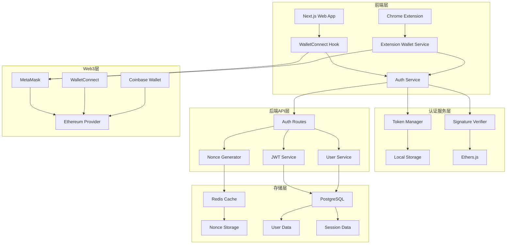
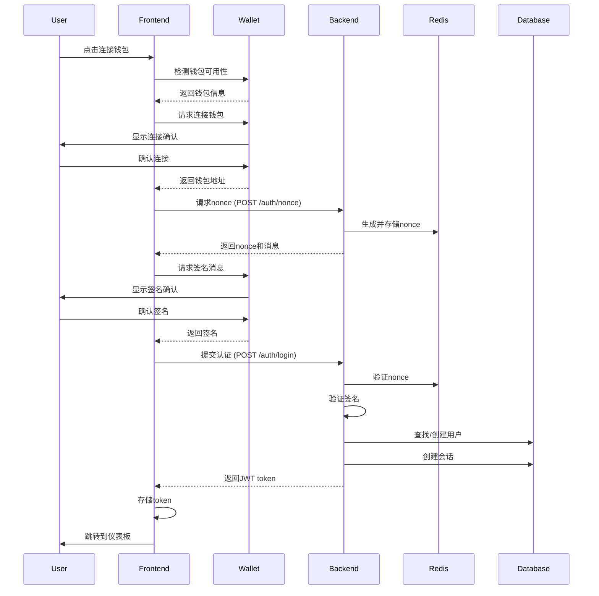

# Web3钱包认证系统设计文档

## 概述

Web3钱包认证系统旨在为多Agent自动化平台提供去中心化的身份认证解决方案。系统基于以太坊钱包签名机制，实现无密码登录，支持前端网页、Chrome插件的统一认证体验。

## 架构

### 系统架构图



### 认证流程图



## 组件和接口

### 前端组件架构

#### 1. WalletConnect Hook
```typescript
interface UseWalletConnect {
  // 状态
  isConnected: boolean;
  isConnecting: boolean;
  walletAddress: string | null;
  chainId: number | null;
  error: string | null;
  
  // 方法
  connect: () => Promise<void>;
  disconnect: () => Promise<void>;
  switchNetwork: (chainId: number) => Promise<void>;
  
  // 事件监听
  onAccountsChanged: (accounts: string[]) => void;
  onChainChanged: (chainId: string) => void;
  onDisconnect: () => void;
}
```

#### 2. Auth Service
```typescript
interface AuthService {
  // 认证方法
  authenticate: (walletAddress: string, signature: string, message: string) => Promise<AuthResult>;
  refreshToken: () => Promise<string>;
  logout: () => Promise<void>;
  
  // 状态管理
  getAuthState: () => AuthState;
  isAuthenticated: () => boolean;
  getToken: () => string | null;
  
  // 事件
  onAuthStateChange: (callback: (state: AuthState) => void) => void;
}
```

#### 3. Wallet Provider Component
```typescript
interface WalletProviderProps {
  children: React.ReactNode;
  autoConnect?: boolean;
  supportedChains?: number[];
}

interface WalletContextValue {
  wallet: UseWalletConnect;
  auth: AuthService;
  user: User | null;
}
```

### Chrome插件架构

#### 1. Background Script
```typescript
interface BackgroundService {
  // 钱包管理
  connectWallet: () => Promise<WalletInfo>;
  disconnectWallet: () => Promise<void>;
  
  // 认证管理
  authenticate: (credentials: AuthCredentials) => Promise<AuthResult>;
  syncAuthState: () => Promise<void>;
  
  // 消息处理
  handleMessage: (message: ExtensionMessage) => Promise<any>;
}
```

#### 2. Content Script
```typescript
interface ContentScript {
  // 页面交互
  injectWalletDetection: () => void;
  handleWalletEvents: () => void;
  
  // 与background通信
  sendMessage: (message: ExtensionMessage) => Promise<any>;
  
  // 页面数据提取
  extractPageData: () => PageData;
}
```

#### 3. Popup Interface
```typescript
interface PopupState {
  walletConnected: boolean;
  userAuthenticated: boolean;
  currentUser: User | null;
  agentStatus: AgentStatus[];
  notifications: Notification[];
}
```

### 后端API接口

#### 1. 认证路由 (已实现)
```typescript
// POST /auth/nonce
interface NonceRequest {
  walletAddress: string;
}

interface NonceResponse {
  nonce: string;
  message: string;
}

// POST /auth/login
interface LoginRequest {
  walletAddress: string;
  signature: string;
  message: string;
}

interface LoginResponse {
  success: boolean;
  token?: string;
  user?: User;
  error?: string;
}
```

#### 2. 用户管理服务
```typescript
interface UserService {
  getUserByWalletAddress: (address: string) => Promise<User | null>;
  createUser: (address: string, preferences: UserPreferences, profile: UserProfile) => Promise<User>;
  updateUser: (userId: string, updates: Partial<User>) => Promise<User>;
  updateLastLogin: (userId: string) => Promise<void>;
}
```

## 数据模型

### 前端状态模型

#### 1. 钱包状态
```typescript
interface WalletState {
  isConnected: boolean;
  isConnecting: boolean;
  address: string | null;
  chainId: number | null;
  balance: string | null;
  provider: any | null;
  error: WalletError | null;
}

interface WalletError {
  code: string;
  message: string;
  details?: any;
}
```

#### 2. 认证状态
```typescript
interface AuthState {
  isAuthenticated: boolean;
  isAuthenticating: boolean;
  token: string | null;
  user: User | null;
  expiresAt: Date | null;
  error: AuthError | null;
}

interface AuthError {
  type: 'WALLET_ERROR' | 'SIGNATURE_ERROR' | 'NETWORK_ERROR' | 'SERVER_ERROR';
  message: string;
  retryable: boolean;
}
```

#### 3. 用户模型
```typescript
interface User {
  id: string;
  walletAddress: string;
  preferences: UserPreferences;
  profile: UserProfile;
  createdAt: Date;
  lastLoginAt: Date;
}

interface UserPreferences {
  theme: 'light' | 'dark';
  language: string;
  timezone: string;
  notifications: NotificationSettings;
  dashboard: DashboardSettings;
  privacy: PrivacySettings;
}
```

### Chrome插件数据模型

#### 1. 插件状态
```typescript
interface ExtensionState {
  wallet: WalletState;
  auth: AuthState;
  agents: AgentInfo[];
  notifications: Notification[];
  settings: ExtensionSettings;
}

interface ExtensionSettings {
  autoConnect: boolean;
  syncWithWebApp: boolean;
  notificationsEnabled: boolean;
  theme: 'light' | 'dark' | 'auto';
}
```

#### 2. 消息协议
```typescript
interface ExtensionMessage {
  type: MessageType;
  payload: any;
  requestId?: string;
  timestamp: number;
}

enum MessageType {
  CONNECT_WALLET = 'CONNECT_WALLET',
  DISCONNECT_WALLET = 'DISCONNECT_WALLET',
  AUTHENTICATE = 'AUTHENTICATE',
  SYNC_STATE = 'SYNC_STATE',
  EXECUTE_AGENT = 'EXECUTE_AGENT',
  GET_PAGE_DATA = 'GET_PAGE_DATA'
}
```

## 错误处理

### 错误分类和处理策略

#### 1. 钱包连接错误
```typescript
enum WalletErrorType {
  NOT_INSTALLED = 'WALLET_NOT_INSTALLED',
  USER_REJECTED = 'USER_REJECTED_CONNECTION',
  NETWORK_ERROR = 'NETWORK_ERROR',
  UNSUPPORTED_CHAIN = 'UNSUPPORTED_CHAIN',
  WALLET_LOCKED = 'WALLET_LOCKED'
}

interface ErrorHandler {
  handleWalletError: (error: WalletErrorType, details?: any) => ErrorResponse;
  handleAuthError: (error: AuthErrorType, details?: any) => ErrorResponse;
  handleNetworkError: (error: NetworkError) => ErrorResponse;
}
```

#### 2. 错误恢复机制
```typescript
interface RetryConfig {
  maxRetries: number;
  retryDelay: number;
  backoffMultiplier: number;
  retryableErrors: string[];
}

interface ErrorRecovery {
  shouldRetry: (error: Error, attempt: number) => boolean;
  getRetryDelay: (attempt: number) => number;
  executeWithRetry: <T>(fn: () => Promise<T>, config: RetryConfig) => Promise<T>;
}
```

### 用户友好的错误提示

#### 1. 错误消息映射
```typescript
const ERROR_MESSAGES = {
  [WalletErrorType.NOT_INSTALLED]: {
    title: '未检测到钱包',
    message: '请安装MetaMask或其他Web3钱包',
    action: '安装MetaMask',
    actionUrl: 'https://metamask.io/download/'
  },
  [WalletErrorType.USER_REJECTED]: {
    title: '连接被拒绝',
    message: '您拒绝了钱包连接请求',
    action: '重试连接',
    actionUrl: null
  },
  [WalletErrorType.UNSUPPORTED_CHAIN]: {
    title: '网络不支持',
    message: '请切换到以太坊主网',
    action: '切换网络',
    actionUrl: null
  }
};
```

## 测试策略

### 单元测试

#### 1. 钱包连接测试
```typescript
describe('WalletConnect Hook', () => {
  test('should detect MetaMask availability', async () => {
    // 测试钱包检测逻辑
  });
  
  test('should handle connection success', async () => {
    // 测试连接成功流程
  });
  
  test('should handle connection rejection', async () => {
    // 测试连接拒绝处理
  });
  
  test('should handle network switching', async () => {
    // 测试网络切换功能
  });
});
```

#### 2. 认证服务测试
```typescript
describe('Auth Service', () => {
  test('should authenticate with valid signature', async () => {
    // 测试有效签名认证
  });
  
  test('should handle invalid signature', async () => {
    // 测试无效签名处理
  });
  
  test('should refresh expired token', async () => {
    // 测试token刷新
  });
  
  test('should handle logout', async () => {
    // 测试登出功能
  });
});
```

### 集成测试

#### 1. 端到端认证流程
```typescript
describe('E2E Authentication Flow', () => {
  test('should complete full authentication flow', async () => {
    // 1. 连接钱包
    // 2. 获取nonce
    // 3. 签名消息
    // 4. 验证认证
    // 5. 存储token
    // 6. 跳转仪表板
  });
  
  test('should handle authentication errors', async () => {
    // 测试各种错误场景
  });
});
```

#### 2. Chrome插件集成测试
```typescript
describe('Chrome Extension Integration', () => {
  test('should sync auth state with web app', async () => {
    // 测试状态同步
  });
  
  test('should handle background script communication', async () => {
    // 测试消息通信
  });
});
```

### 性能测试

#### 1. 认证性能指标
- 钱包连接时间 < 2秒
- 签名验证时间 < 1秒
- Token刷新时间 < 500ms
- 状态同步时间 < 300ms

#### 2. 内存和存储优化
- 本地存储使用 < 1MB
- 内存占用 < 10MB
- 缓存命中率 > 90%

## 安全考虑

### 1. 私钥安全
- 私钥永远不离开用户设备
- 不在任何地方存储或传输私钥
- 使用钱包提供的签名API

### 2. Token安全
- JWT token使用强加密算法
- Token包含过期时间和刷新机制
- 敏感信息不存储在token中

### 3. 通信安全
- 所有API调用使用HTTPS
- 验证所有用户输入
- 防止CSRF和XSS攻击

### 4. 存储安全
- 敏感数据加密存储
- 定期清理过期数据
- 实现安全的数据备份

## 部署和监控

### 1. 部署策略
- 前端部署到CDN
- 后端API部署到容器
- Chrome插件发布到商店

### 2. 监控指标
- 认证成功率
- 错误率和类型分布
- 响应时间监控
- 用户行为分析

### 3. 日志记录
- 认证事件日志
- 错误详细日志
- 性能监控日志
- 安全事件日志

这个设计文档提供了完整的Web3钱包认证系统架构，涵盖了前端集成、Chrome插件、后端API、数据模型、错误处理、测试策略和安全考虑等各个方面。