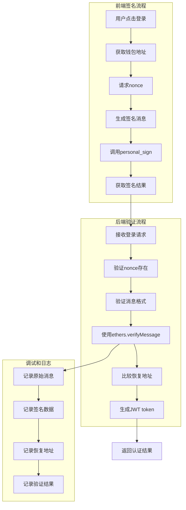
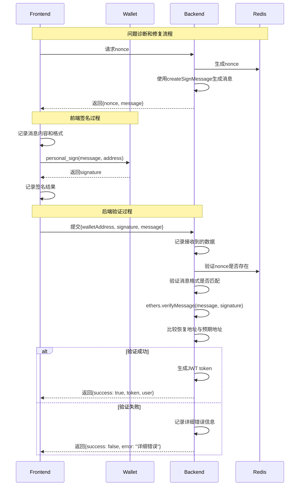

# Web3签名验证修复设计文档

## 概述

本设计文档专注于修复Web3钱包认证系统中的签名验证失败问题。当前系统在用户尝试登录时出现"签名验证失败"错误，主要原因是前端使用personal_sign方法与后端ethers.verifyMessage方法之间的兼容性问题。需要确保消息格式一致性、签名验证逻辑正确性，并添加详细的调试信息。

## 架构

### 签名验证流程架构



### 签名验证详细流程



## 组件和接口

### 签名验证核心接口

#### 1. 消息格式标准化
```typescript
interface SignatureMessage {
  // 标准化的消息生成
  createSignMessage: (walletAddress: string, nonce: string) => string;
  
  // 消息验证
  validateMessageFormat: (message: string, expectedFormat: string) => boolean;
  
  // 调试信息
  getMessageDebugInfo: (message: string) => MessageDebugInfo;
}

interface MessageDebugInfo {
  length: number;
  hexRepresentation: string;
  lineBreaks: string[];
  encoding: string;
  hash: string;
}
```

#### 2. 签名验证服务
```typescript
interface SignatureVerificationService {
  // 核心验证方法
  verifySignature: (message: string, signature: string, expectedAddress: string) => Promise<VerificationResult>;
  
  // 调试方法
  debugSignatureVerification: (message: string, signature: string, expectedAddress: string) => Promise<DebugResult>;
  
  // 兼容性检查
  checkPersonalSignCompatibility: (message: string, signature: string) => Promise<CompatibilityResult>;
}

interface VerificationResult {
  isValid: boolean;
  recoveredAddress: string;
  error?: string;
  debugInfo?: DebugResult;
}

interface DebugResult {
  originalMessage: string;
  messageHash: string;
  signature: string;
  recoveredAddress: string;
  expectedAddress: string;
  ethersVersion: string;
  verificationSteps: VerificationStep[];
}
```

#### 3. Nonce管理接口
```typescript
interface NonceManager {
  // Nonce生成和存储
  generateNonce: (walletAddress: string) => Promise<NonceData>;
  
  // Nonce验证和清理
  validateNonce: (walletAddress: string, nonce: string) => Promise<boolean>;
  cleanupExpiredNonces: () => Promise<void>;
  
  // 调试方法
  getNonceDebugInfo: (walletAddress: string) => Promise<NonceDebugInfo>;
}

interface NonceData {
  nonce: string;
  message: string;
  expiresAt: Date;
  walletAddress: string;
}

interface NonceDebugInfo {
  stored: string | null;
  expiresAt: Date | null;
  isExpired: boolean;
  timeRemaining: number;
}
```

### 调试和日志系统

#### 1. 签名验证日志
```typescript
interface SignatureVerificationLogger {
  // 详细日志记录
  logVerificationAttempt: (data: VerificationAttemptData) => void;
  logVerificationResult: (result: VerificationResult) => void;
  logError: (error: SignatureVerificationError) => void;
  
  // 调试模式
  enableDebugMode: () => void;
  disableDebugMode: () => void;
  getDebugLogs: () => DebugLog[];
}

interface VerificationAttemptData {
  timestamp: Date;
  walletAddress: string;
  message: string;
  messageLength: number;
  signature: string;
  signatureLength: number;
  nonce: string;
}

interface SignatureVerificationError {
  type: 'NONCE_ERROR' | 'MESSAGE_FORMAT_ERROR' | 'SIGNATURE_ERROR' | 'ADDRESS_MISMATCH';
  message: string;
  details: any;
  timestamp: Date;
}
```

#### 2. 前端调试工具
```typescript
interface FrontendDebugTools {
  // 消息格式检查
  validateMessageFormat: (message: string) => MessageFormatValidation;
  
  // 签名测试
  testSignature: (message: string, signature: string, address: string) => Promise<SignatureTest>;
  
  // 网络连接测试
  testBackendConnection: () => Promise<ConnectionTest>;
}

interface MessageFormatValidation {
  isValid: boolean;
  expectedFormat: string;
  actualFormat: string;
  differences: string[];
}

interface SignatureTest {
  canRecover: boolean;
  recoveredAddress: string;
  matches: boolean;
  error?: string;
}
```

### 后端API增强

#### 1. 增强的认证路由
```typescript
// POST /auth/nonce - 增强版本
interface NonceRequest {
  walletAddress: string;
  debug?: boolean; // 启用调试模式
}

interface NonceResponse {
  nonce: string;
  message: string;
  messageHash?: string; // 调试信息
  debugInfo?: {
    messageLength: number;
    encoding: string;
    timestamp: Date;
  };
}

// POST /auth/login - 增强版本
interface LoginRequest {
  walletAddress: string;
  signature: string;
  message: string;
  debug?: boolean;
}

interface LoginResponse {
  success: boolean;
  token?: string;
  user?: User;
  error?: string;
  debugInfo?: {
    nonceValidation: NonceValidationResult;
    messageValidation: MessageValidationResult;
    signatureValidation: SignatureValidationResult;
  };
}
```

#### 2. 调试API端点
```typescript
// POST /auth/debug/verify-signature
interface DebugVerifyRequest {
  message: string;
  signature: string;
  expectedAddress: string;
}

interface DebugVerifyResponse {
  canRecover: boolean;
  recoveredAddress: string;
  matches: boolean;
  steps: VerificationStep[];
  ethersVersion: string;
  error?: string;
}

// GET /auth/debug/nonce/:address
interface DebugNonceResponse {
  exists: boolean;
  nonce?: string;
  expiresAt?: Date;
  timeRemaining?: number;
  isExpired: boolean;
}
```

## 数据模型

### 签名验证数据模型

#### 1. 验证结果模型
```typescript
interface VerificationStep {
  step: string;
  input: any;
  output: any;
  success: boolean;
  error?: string;
  timestamp: Date;
}

interface NonceValidationResult {
  exists: boolean;
  matches: boolean;
  isExpired: boolean;
  storedNonce?: string;
  providedNonce?: string;
  expiresAt?: Date;
}

interface MessageValidationResult {
  formatMatches: boolean;
  expectedMessage: string;
  providedMessage: string;
  differences?: string[];
  encoding: string;
}

interface SignatureValidationResult {
  canRecover: boolean;
  recoveredAddress: string;
  expectedAddress: string;
  matches: boolean;
  ethersVersion: string;
  error?: string;
}
```

#### 2. 调试数据模型
```typescript
interface DebugSession {
  sessionId: string;
  walletAddress: string;
  startTime: Date;
  steps: DebugStep[];
  finalResult: 'SUCCESS' | 'FAILURE';
  error?: string;
}

interface DebugStep {
  stepName: string;
  timestamp: Date;
  input: any;
  output: any;
  duration: number;
  success: boolean;
  error?: string;
}

interface SignatureDebugData {
  originalMessage: string;
  messageBytes: Uint8Array;
  messageHash: string;
  signature: string;
  signatureBytes: Uint8Array;
  recoveryId: number;
  publicKey: string;
  recoveredAddress: string;
}
```

### 错误分类和处理

#### 1. 签名验证错误类型
```typescript
enum SignatureVerificationErrorType {
  NONCE_NOT_FOUND = 'NONCE_NOT_FOUND',
  NONCE_EXPIRED = 'NONCE_EXPIRED',
  NONCE_MISMATCH = 'NONCE_MISMATCH',
  MESSAGE_FORMAT_INVALID = 'MESSAGE_FORMAT_INVALID',
  SIGNATURE_INVALID = 'SIGNATURE_INVALID',
  ADDRESS_MISMATCH = 'ADDRESS_MISMATCH',
  ETHERS_VERIFICATION_FAILED = 'ETHERS_VERIFICATION_FAILED',
  PERSONAL_SIGN_INCOMPATIBLE = 'PERSONAL_SIGN_INCOMPATIBLE'
}

interface SignatureVerificationError {
  type: SignatureVerificationErrorType;
  message: string;
  details: {
    walletAddress?: string;
    nonce?: string;
    signature?: string;
    recoveredAddress?: string;
    expectedAddress?: string;
    originalError?: any;
  };
  timestamp: Date;
  debugInfo?: DebugStep[];
}
```

#### 2. 恢复策略
```typescript
interface RecoveryStrategy {
  errorType: SignatureVerificationErrorType;
  canRetry: boolean;
  retryDelay: number;
  maxRetries: number;
  recoveryAction: RecoveryAction;
}

enum RecoveryAction {
  REGENERATE_NONCE = 'REGENERATE_NONCE',
  RETRY_SIGNATURE = 'RETRY_SIGNATURE',
  REFRESH_WALLET_CONNECTION = 'REFRESH_WALLET_CONNECTION',
  CLEAR_CACHE = 'CLEAR_CACHE',
  MANUAL_INTERVENTION = 'MANUAL_INTERVENTION'
}
```

## 错误处理

### 签名验证错误处理策略

#### 1. 错误检测和分类
```typescript
class SignatureVerificationErrorHandler {
  // 错误检测
  detectErrorType(error: any, context: VerificationContext): SignatureVerificationErrorType {
    if (error.message?.includes('nonce')) {
      return SignatureVerificationErrorType.NONCE_NOT_FOUND;
    }
    if (error.message?.includes('invalid signature')) {
      return SignatureVerificationErrorType.SIGNATURE_INVALID;
    }
    if (error.message?.includes('address mismatch')) {
      return SignatureVerificationErrorType.ADDRESS_MISMATCH;
    }
    return SignatureVerificationErrorType.ETHERS_VERIFICATION_FAILED;
  }
  
  // 错误处理
  handleError(error: SignatureVerificationError): ErrorHandlingResult {
    const strategy = this.getRecoveryStrategy(error.type);
    return {
      canRecover: strategy.canRetry,
      recoveryAction: strategy.recoveryAction,
      userMessage: this.getUserFriendlyMessage(error),
      debugInfo: error.debugInfo
    };
  }
}
```

#### 2. 用户友好的错误消息
```typescript
const SIGNATURE_ERROR_MESSAGES = {
  [SignatureVerificationErrorType.NONCE_NOT_FOUND]: {
    title: 'Nonce已过期',
    message: '签名验证码已过期，请重新获取',
    action: '重新获取验证码',
    technical: 'Nonce not found in Redis cache'
  },
  [SignatureVerificationErrorType.SIGNATURE_INVALID]: {
    title: '签名无效',
    message: '数字签名验证失败，请重新签名',
    action: '重新签名',
    technical: 'ethers.verifyMessage failed to recover address'
  },
  [SignatureVerificationErrorType.ADDRESS_MISMATCH]: {
    title: '地址不匹配',
    message: '签名地址与钱包地址不匹配',
    action: '检查钱包连接',
    technical: 'Recovered address does not match wallet address'
  },
  [SignatureVerificationErrorType.MESSAGE_FORMAT_INVALID]: {
    title: '消息格式错误',
    message: '签名消息格式不正确',
    action: '重新生成消息',
    technical: 'Message format does not match expected format'
  }
};
```

## 测试策略

### 签名验证测试

#### 1. 消息格式一致性测试
```typescript
describe('Message Format Consistency', () => {
  test('should generate identical messages on frontend and backend', () => {
    const walletAddress = '0x1234567890123456789012345678901234567890';
    const nonce = 'test-nonce-123';
    
    const frontendMessage = createSignMessage(walletAddress, nonce);
    const backendMessage = createSignMessage(walletAddress, nonce);
    
    expect(frontendMessage).toBe(backendMessage);
    expect(frontendMessage.length).toBe(backendMessage.length);
  });
  
  test('should handle special characters consistently', () => {
    // 测试换行符、特殊字符的处理
  });
  
  test('should maintain encoding consistency', () => {
    // 测试UTF-8编码一致性
  });
});
```

#### 2. 签名验证兼容性测试
```typescript
describe('Signature Verification Compatibility', () => {
  test('should verify personal_sign signatures with ethers.verifyMessage', async () => {
    const message = 'Test message for signing';
    const privateKey = '0x...'; // 测试私钥
    const wallet = new ethers.Wallet(privateKey);
    
    // 模拟personal_sign
    const signature = await wallet.signMessage(message);
    
    // 使用ethers.verifyMessage验证
    const recoveredAddress = ethers.verifyMessage(message, signature);
    
    expect(recoveredAddress.toLowerCase()).toBe(wallet.address.toLowerCase());
  });
  
  test('should handle different signature formats', async () => {
    // 测试不同的签名格式兼容性
  });
});
```

#### 3. Nonce管理测试
```typescript
describe('Nonce Management', () => {
  test('should generate unique nonces', async () => {
    const nonce1 = generateNonce();
    const nonce2 = generateNonce();
    expect(nonce1).not.toBe(nonce2);
  });
  
  test('should expire nonces after timeout', async () => {
    // 测试nonce过期机制
  });
  
  test('should prevent nonce reuse', async () => {
    // 测试nonce重复使用防护
  });
});
```

### 调试和监控测试

#### 1. 调试信息测试
```typescript
describe('Debug Information', () => {
  test('should provide detailed verification steps', async () => {
    const debugResult = await debugSignatureVerification(message, signature, address);
    
    expect(debugResult.steps).toHaveLength(5);
    expect(debugResult.steps[0].step).toBe('message_validation');
    expect(debugResult.steps[1].step).toBe('signature_parsing');
    expect(debugResult.steps[2].step).toBe('address_recovery');
    expect(debugResult.steps[3].step).toBe('address_comparison');
    expect(debugResult.steps[4].step).toBe('final_result');
  });
  
  test('should capture error details', async () => {
    // 测试错误详情捕获
  });
});
```

### 性能和可靠性测试

#### 1. 签名验证性能
- 单次签名验证 < 100ms
- Nonce生成和存储 < 50ms
- 消息格式验证 < 10ms
- 错误处理响应 < 20ms

#### 2. 并发处理测试
```typescript
describe('Concurrent Signature Verification', () => {
  test('should handle multiple simultaneous verifications', async () => {
    const promises = Array.from({ length: 100 }, () => 
      verifySignature(message, signature, address)
    );
    
    const results = await Promise.all(promises);
    expect(results.every(r => r.isValid)).toBe(true);
  });
});
```

## 实施计划

### 阶段1：问题诊断和修复（优先级：高）

#### 1.1 添加详细调试日志
- 在前端WalletContext中添加签名过程日志
- 在后端auth.ts中添加验证过程日志
- 记录消息内容、签名数据、恢复地址等关键信息

#### 1.2 验证消息格式一致性
- 确保前后端使用相同的createSignMessage函数
- 检查消息编码和换行符处理
- 验证nonce格式和生成逻辑

#### 1.3 修复签名验证逻辑
- 确认ethers.verifyMessage与personal_sign的兼容性
- 处理地址大小写问题
- 修复任何编码或格式问题

### 阶段2：增强错误处理（优先级：中）

#### 2.1 实现详细错误分类
- 区分不同类型的签名验证错误
- 提供用户友好的错误消息
- 实现错误恢复策略

#### 2.2 添加调试API端点
- 创建签名验证调试接口
- 提供nonce状态查询接口
- 实现验证步骤跟踪

### 阶段3：测试和验证（优先级：中）

#### 3.1 创建全面的测试套件
- 单元测试覆盖所有签名验证逻辑
- 集成测试验证端到端流程
- 性能测试确保响应时间

#### 3.2 实施监控和日志
- 部署生产环境监控
- 实现错误率和成功率跟踪
- 创建性能指标仪表板

## 成功标准

### 功能标准
1. 用户能够成功完成Web3钱包登录
2. 签名验证成功率达到99%以上
3. 错误信息清晰且可操作
4. 调试信息完整且有用

### 性能标准
1. 签名验证响应时间 < 1秒
2. 错误处理响应时间 < 500ms
3. 系统可用性 > 99.9%
4. 并发处理能力 > 100 req/s

### 用户体验标准
1. 错误消息用户友好
2. 重试机制简单直观
3. 调试信息对开发者有用
4. 整体流程流畅无阻

这个设计文档专注于解决Web3签名验证失败的核心问题，提供了详细的技术方案、实施计划和成功标准。