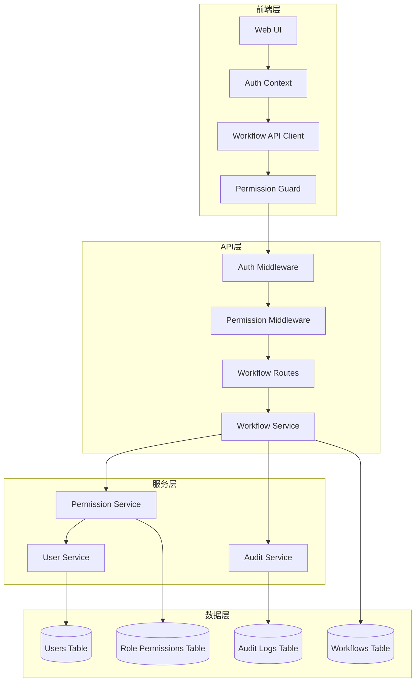
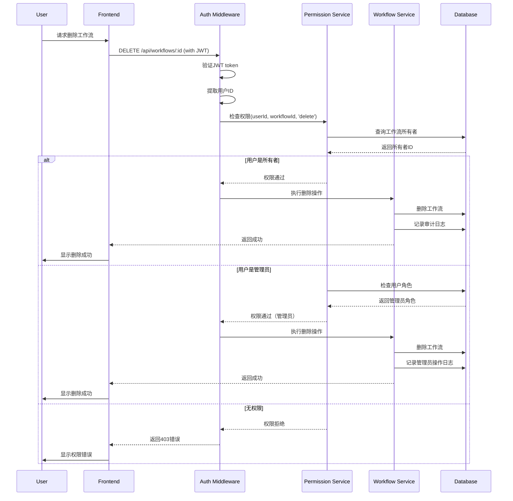

# 工作流所有权和权限管理设计文档

## 概述

本设计文档描述了如何在现有的Web3认证系统基础上，实现完整的工作流所有权和权限管理系统。系统将钱包地址映射到用户ID，建立清晰的资源所有权模型，并实现基于角色的访问控制（RBAC）。

## 架构

### 系统架构图



### 权限验证流程



## 组件和接口

### 数据库Schema更新

#### 1. Users表增强
```sql
-- 用户表已存在，需要添加角色字段
ALTER TABLE users ADD COLUMN IF NOT EXISTS role VARCHAR(20) DEFAULT 'user';
ALTER TABLE users ADD COLUMN IF NOT EXISTS is_test_user BOOLEAN DEFAULT FALSE;

-- 创建索引
CREATE INDEX IF NOT EXISTS idx_users_wallet_address ON users(wallet_address);
CREATE INDEX IF NOT EXISTS idx_users_role ON users(role);

-- 角色枚举: 'user', 'admin', 'test'
```

#### 2. Workflows表更新
```sql
-- 工作流表已存在，确保有created_by字段
-- created_by字段应该已经存在，指向users表的id

-- 创建索引优化查询
CREATE INDEX IF NOT EXISTS idx_workflows_created_by ON workflows(created_by);
CREATE INDEX IF NOT EXISTS idx_workflows_status_created_by ON workflows(status, created_by);
```

#### 3. 审计日志表
```sql
CREATE TABLE IF NOT EXISTS audit_logs (
    id UUID PRIMARY KEY DEFAULT gen_random_uuid(),
    user_id UUID NOT NULL REFERENCES users(id),
    action VARCHAR(50) NOT NULL,
    resource_type VARCHAR(50) NOT NULL,
    resource_id UUID NOT NULL,
    details JSONB,
    ip_address VARCHAR(45),
    user_agent TEXT,
    created_at TIMESTAMP WITH TIME ZONE DEFAULT CURRENT_TIMESTAMP,
    
    -- 索引
    INDEX idx_audit_user_id (user_id),
    INDEX idx_audit_resource (resource_type, resource_id),
    INDEX idx_audit_created_at (created_at DESC)
);

-- 操作类型: 'create', 'read', 'update', 'delete', 'execute'
-- 资源类型: 'workflow', 'execution', 'agent'
```

### 后端服务接口

#### 1. Permission Service
```typescript
interface PermissionService {
  // 权限检查
  canAccessWorkflow(userId: string, workflowId: string): Promise<boolean>;
  canModifyWorkflow(userId: string, workflowId: string): Promise<boolean>;
  canDeleteWorkflow(userId: string, workflowId: string): Promise<boolean>;
  canExecuteWorkflow(userId: string, workflowId: string): Promise<boolean>;
  
  // 角色检查
  isAdmin(userId: string): Promise<boolean>;
  isTestUser(userId: string): Promise<boolean>;
  getUserRole(userId: string): Promise<UserRole>;
  
  // 批量权限检查
  filterAccessibleWorkflows(userId: string, workflowIds: string[]): Promise<string[]>;
}

enum UserRole {
  USER = 'user',
  ADMIN = 'admin',
  TEST = 'test'
}

interface PermissionCheckResult {
  allowed: boolean;
  reason?: string;
  requiredRole?: UserRole;
}
```

#### 2. Audit Service
```typescript
interface AuditService {
  // 记录操作
  logAction(entry: AuditLogEntry): Promise<void>;
  
  // 查询日志
  getAuditLogs(filters: AuditLogFilters): Promise<AuditLog[]>;
  getUserActions(userId: string, options?: QueryOptions): Promise<AuditLog[]>;
  getResourceHistory(resourceType: string, resourceId: string): Promise<AuditLog[]>;
  
  // 统计分析
  getActionStats(filters: AuditLogFilters): Promise<ActionStats>;
}

interface AuditLogEntry {
  userId: string;
  action: 'create' | 'read' | 'update' | 'delete' | 'execute';
  resourceType: 'workflow' | 'execution' | 'agent';
  resourceId: string;
  details?: Record<string, any>;
  ipAddress?: string;
  userAgent?: string;
}

interface AuditLog extends AuditLogEntry {
  id: string;
  createdAt: Date;
  user?: {
    id: string;
    walletAddress: string;
    role: UserRole;
  };
}
```

#### 3. User Service增强
```typescript
interface UserService {
  // 现有方法
  getUserByWalletAddress(address: string): Promise<User | null>;
  createUser(address: string, preferences: UserPreferences, profile: UserProfile): Promise<User>;
  updateUser(userId: string, updates: Partial<User>): Promise<User>;
  
  // 新增方法
  getUserById(userId: string): Promise<User | null>;
  setUserRole(userId: string, role: UserRole): Promise<void>;
  isAdmin(userId: string): Promise<boolean>;
  
  // 批量操作
  getUsersByIds(userIds: string[]): Promise<User[]>;
  getAdminUsers(): Promise<User[]>;
}

interface User {
  id: string;
  walletAddress: string;
  role: UserRole;
  isTestUser: boolean;
  preferences: UserPreferences;
  profile: UserProfile;
  createdAt: Date;
  lastLoginAt: Date;
}
```

### API路由更新

#### 1. 工作流路由增强
```typescript
// 现有路由保持不变，添加权限中间件

// GET /api/workflows - 列出用户的工作流
router.get('/', 
  authMiddleware,
  async (req, res) => {
    const userId = req.user.id;
    const isAdmin = await permissionService.isAdmin(userId);
    
    // 管理员可以看到所有工作流，普通用户只看自己的
    const filters = {
      ...req.query,
      createdBy: isAdmin ? undefined : userId,
      excludeTestData: !isAdmin
    };
    
    const workflows = await workflowService.listWorkflows(filters);
    res.json({ success: true, data: workflows });
  }
);

// DELETE /api/workflows/:id - 删除工作流（新增）
router.delete('/:id',
  authMiddleware,
  permissionMiddleware('workflow', 'delete'),
  async (req, res) => {
    const { id } = req.params;
    const userId = req.user.id;
    
    await workflowService.deleteWorkflow(id, userId);
    await auditService.logAction({
      userId,
      action: 'delete',
      resourceType: 'workflow',
      resourceId: id
    });
    
    res.json({ success: true, message: 'Workflow deleted successfully' });
  }
);

// PUT /api/workflows/:id - 更新工作流
router.put('/:id',
  authMiddleware,
  permissionMiddleware('workflow', 'update'),
  async (req, res) => {
    const { id } = req.params;
    const userId = req.user.id;
    const updates = req.body;
    
    const workflow = await workflowService.updateWorkflow(id, updates, userId);
    await auditService.logAction({
      userId,
      action: 'update',
      resourceType: 'workflow',
      resourceId: id,
      details: { updates }
    });
    
    res.json({ success: true, data: workflow });
  }
);
```

#### 2. 权限中间件
```typescript
interface PermissionMiddleware {
  (resourceType: string, action: string): RequestHandler;
}

const permissionMiddleware: PermissionMiddleware = (resourceType, action) => {
  return async (req, res, next) => {
    try {
      const userId = req.user?.id;
      if (!userId) {
        return res.status(401).json({
          success: false,
          error: 'Authentication required'
        });
      }
      
      const resourceId = req.params.id;
      const canPerform = await permissionService.checkPermission(
        userId,
        resourceType,
        resourceId,
        action
      );
      
      if (!canPerform.allowed) {
        return res.status(403).json({
          success: false,
          error: canPerform.reason || 'Permission denied',
          requiredRole: canPerform.requiredRole
        });
      }
      
      next();
    } catch (error) {
      logger.error('Permission check failed:', error);
      res.status(500).json({
        success: false,
        error: 'Permission check failed'
      });
    }
  };
};
```

#### 3. 公共API路由更新
```typescript
// 公共API应该移除或严格限制
// 建议：只保留读取功能，移除创建/修改/删除

// GET /api/public/workflows - 只读访问（可选）
router.get('/',
  rateLimitMiddleware, // 添加速率限制
  async (req, res) => {
    // 只返回公开的工作流（如果有公开功能）
    // 或者完全移除此端点
  }
);

// 移除 POST /api/public/workflows
// 移除 PUT /api/public/workflows/:id
// 移除 DELETE /api/public/workflows/:id
```

### 前端组件更新

#### 1. 权限上下文
```typescript
interface PermissionContext {
  canDelete: (workflowId: string) => boolean;
  canEdit: (workflowId: string) => boolean;
  canExecute: (workflowId: string) => boolean;
  isAdmin: boolean;
  currentUserId: string;
}

const usePermissions = (): PermissionContext => {
  const { user } = useAuth();
  
  return {
    canDelete: (workflowId: string) => {
      // 检查是否为所有者或管理员
      return user?.role === 'admin' || isOwner(workflowId);
    },
    canEdit: (workflowId: string) => {
      return user?.role === 'admin' || isOwner(workflowId);
    },
    canExecute: (workflowId: string) => {
      return user?.role === 'admin' || isOwner(workflowId);
    },
    isAdmin: user?.role === 'admin',
    currentUserId: user?.id || ''
  };
};
```

#### 2. 工作流列表组件更新
```typescript
const WorkflowList: React.FC = () => {
  const { user } = useAuth();
  const { canDelete, canEdit, isAdmin } = usePermissions();
  const [workflows, setWorkflows] = useState<Workflow[]>([]);
  
  const handleDelete = async (workflowId: string) => {
    if (!canDelete(workflowId)) {
      toast.error('You do not have permission to delete this workflow');
      return;
    }
    
    if (!confirm('Are you sure you want to delete this workflow?')) {
      return;
    }
    
    try {
      await workflowAPI.delete(workflowId);
      setWorkflows(workflows.filter(w => w.id !== workflowId));
      toast.success('Workflow deleted successfully');
    } catch (error) {
      toast.error(error.message || 'Failed to delete workflow');
    }
  };
  
  return (
    <div>
      {workflows.map(workflow => (
        <WorkflowCard
          key={workflow.id}
          workflow={workflow}
          canEdit={canEdit(workflow.id)}
          canDelete={canDelete(workflow.id)}
          onDelete={() => handleDelete(workflow.id)}
          showOwner={isAdmin} // 管理员可以看到所有者信息
        />
      ))}
    </div>
  );
};
```

#### 3. API客户端更新
```typescript
class WorkflowAPI {
  // 现有方法
  async list(filters?: WorkflowFilters): Promise<WorkflowListResponse> {
    const response = await fetch('/api/workflows?' + new URLSearchParams(filters));
    return response.json();
  }
  
  async get(id: string): Promise<Workflow> {
    const response = await fetch(`/api/workflows/${id}`);
    return response.json();
  }
  
  async create(data: CreateWorkflowDto): Promise<Workflow> {
    const response = await fetch('/api/workflows', {
      method: 'POST',
      headers: { 'Content-Type': 'application/json' },
      body: JSON.stringify(data)
    });
    return response.json();
  }
  
  async update(id: string, data: UpdateWorkflowDto): Promise<Workflow> {
    const response = await fetch(`/api/workflows/${id}`, {
      method: 'PUT',
      headers: { 'Content-Type': 'application/json' },
      body: JSON.stringify(data)
    });
    return response.json();
  }
  
  // 新增方法
  async delete(id: string): Promise<void> {
    const response = await fetch(`/api/workflows/${id}`, {
      method: 'DELETE'
    });
    
    if (!response.ok) {
      const error = await response.json();
      throw new Error(error.error || 'Failed to delete workflow');
    }
  }
}
```

## 数据模型

### 权限模型

```typescript
interface Permission {
  resource: 'workflow' | 'execution' | 'agent';
  action: 'create' | 'read' | 'update' | 'delete' | 'execute';
  condition?: PermissionCondition;
}

interface PermissionCondition {
  type: 'owner' | 'role' | 'shared';
  value?: any;
}

// 权限规则定义
const PERMISSION_RULES: Record<UserRole, Permission[]> = {
  [UserRole.USER]: [
    { resource: 'workflow', action: 'create' },
    { resource: 'workflow', action: 'read', condition: { type: 'owner' } },
    { resource: 'workflow', action: 'update', condition: { type: 'owner' } },
    { resource: 'workflow', action: 'delete', condition: { type: 'owner' } },
    { resource: 'workflow', action: 'execute', condition: { type: 'owner' } }
  ],
  [UserRole.ADMIN]: [
    { resource: 'workflow', action: 'create' },
    { resource: 'workflow', action: 'read' },
    { resource: 'workflow', action: 'update' },
    { resource: 'workflow', action: 'delete' },
    { resource: 'workflow', action: 'execute' }
  ],
  [UserRole.TEST]: [
    { resource: 'workflow', action: 'create' },
    { resource: 'workflow', action: 'read', condition: { type: 'owner' } }
  ]
};
```

## 错误处理

### 权限错误类型

```typescript
enum PermissionErrorType {
  NOT_AUTHENTICATED = 'NOT_AUTHENTICATED',
  NOT_AUTHORIZED = 'NOT_AUTHORIZED',
  RESOURCE_NOT_FOUND = 'RESOURCE_NOT_FOUND',
  INVALID_OWNER = 'INVALID_OWNER'
}

interface PermissionError extends Error {
  type: PermissionErrorType;
  statusCode: number;
  details?: any;
}

const PERMISSION_ERROR_MESSAGES = {
  [PermissionErrorType.NOT_AUTHENTICATED]: {
    message: 'Please connect your wallet to continue',
    statusCode: 401
  },
  [PermissionErrorType.NOT_AUTHORIZED]: {
    message: 'You do not have permission to perform this action',
    statusCode: 403
  },
  [PermissionErrorType.RESOURCE_NOT_FOUND]: {
    message: 'The requested resource was not found',
    statusCode: 404
  },
  [PermissionErrorType.INVALID_OWNER]: {
    message: 'Only the workflow owner can perform this action',
    statusCode: 403
  }
};
```

## 测试策略

### 单元测试

```typescript
describe('PermissionService', () => {
  test('should allow owner to delete workflow', async () => {
    const canDelete = await permissionService.canDeleteWorkflow(ownerId, workflowId);
    expect(canDelete).toBe(true);
  });
  
  test('should deny non-owner to delete workflow', async () => {
    const canDelete = await permissionService.canDeleteWorkflow(otherUserId, workflowId);
    expect(canDelete).toBe(false);
  });
  
  test('should allow admin to delete any workflow', async () => {
    const canDelete = await permissionService.canDeleteWorkflow(adminId, workflowId);
    expect(canDelete).toBe(true);
  });
});
```

### 集成测试

```typescript
describe('Workflow Deletion', () => {
  test('should successfully delete owned workflow', async () => {
    const response = await request(app)
      .delete(`/api/workflows/${workflowId}`)
      .set('Authorization', `Bearer ${ownerToken}`);
    
    expect(response.status).toBe(200);
    expect(response.body.success).toBe(true);
  });
  
  test('should reject deletion of non-owned workflow', async () => {
    const response = await request(app)
      .delete(`/api/workflows/${workflowId}`)
      .set('Authorization', `Bearer ${otherUserToken}`);
    
    expect(response.status).toBe(403);
    expect(response.body.error).toContain('permission');
  });
});
```

## 安全考虑

### 1. 权限检查
- 所有API端点都必须经过认证
- 所有资源操作都必须经过权限验证
- 使用白名单而非黑名单方式定义权限

### 2. 审计日志
- 记录所有敏感操作
- 包含用户ID、IP地址、操作时间
- 定期审查异常操作模式

### 3. 数据隔离
- 用户只能访问自己的数据
- 测试数据与生产数据隔离
- 管理员操作需要额外验证

### 4. 防止权限提升
- 用户不能修改自己的角色
- 角色变更需要管理员操作
- 记录所有角色变更操作

## 部署和迁移

### 数据库迁移步骤

```sql
-- 1. 添加角色字段
ALTER TABLE users ADD COLUMN IF NOT EXISTS role VARCHAR(20) DEFAULT 'user';
ALTER TABLE users ADD COLUMN IF NOT EXISTS is_test_user BOOLEAN DEFAULT FALSE;

-- 2. 标记测试用户
UPDATE users 
SET is_test_user = TRUE, role = 'test'
WHERE id = '00000000-0000-0000-0000-000000000001';

-- 3. 设置管理员（需要手动指定）
-- UPDATE users SET role = 'admin' WHERE wallet_address = '0x...';

-- 4. 创建审计日志表
CREATE TABLE IF NOT EXISTS audit_logs (...);

-- 5. 创建索引
CREATE INDEX IF NOT EXISTS idx_users_role ON users(role);
CREATE INDEX IF NOT EXISTS idx_workflows_created_by ON workflows(created_by);

-- 6. 验证数据完整性
SELECT COUNT(*) FROM workflows WHERE created_by IS NULL;
```

### 部署检查清单

- [ ] 数据库迁移已执行
- [ ] 所有现有工作流都有有效的created_by
- [ ] 测试用户已正确标记
- [ ] 至少有一个管理员账户
- [ ] 权限中间件已添加到所有路由
- [ ] 前端权限检查已实现
- [ ] 审计日志功能已启用
- [ ] 错误处理已完善
- [ ] 集成测试已通过
- [ ] 文档已更新

这个设计文档提供了完整的权限管理系统架构，包括数据库schema、服务接口、API路由、前端组件、错误处理和测试策略。
